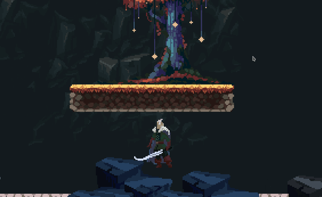

#

千卂几匚ㄚ 丂乇乇丨几Ꮆ ㄚㄖㄩ 卄乇尺乇!

<a href="https://github.com/antilopinae" target="_blank" style="color:#eef4ed;font-size:100%;background-color:0b2545;margin:3% 0%">(っ◔◡◔)っ ♥ Mikhail ♥ </a>
</img>

# 

</img>

- 🌱 I’m currently learning **C++** and **Kotlin**
- 🌍 I speak Russian (native), English

### Always open to collaborating on projects and innovative/disruptive ideas.

# 
# Love Technologies

# 

<h1 align="left">
Languages And Tools:
</h1>

# 
### [Example of my network Kotlin project](https://github.com/antilopinae/_WarpedRealms)

#### [Link to the server project](https://github.com/antilopinae/_WarpedRealmsServer)

#
## Now I'm also working with:
### - [Numerical Linear Algebra](https://github.com/antilopinae/Numerical-Linear-Algebra) in National Research Nuclear University **MEPhI** (Moscow Engineering Physics Institute)

# 
# Activity

# 
# Stats

</img>

#
## Contact me

##### mikbas31@gmail.com
