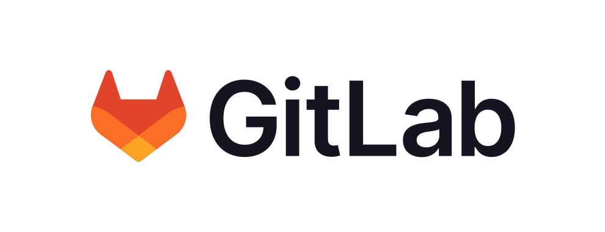

千卂几匚ㄚ 丂乇乇丨几Ꮆ ㄚㄖㄩ 卄乇尺乇!

<a href="https://github.com/antilopinae" target="_blank" style="color:#eef4ed;font-size:100%;background-color:0b2545;margin:3% 0%">(っ◔◡◔)っ ♥ Mikhail ♥ </a> 
</img>

---

### ⚠️ You can find my detailed CV 👉 [Техническое резюме](./sources/MikhailBaskakovCV.md)
> 👉 [Вы можете скачать его в формате pdf](./sources/MikhailBaskakovCV.pdf)

---

I'm Mikhail Baskakov, a Systems C/C++ Engineer and 3rd-year Applied Mathematics & Informatics student at MEPhI. I have over 2 years of experience in designing high-performance systems, with a strong focus on Build Engineering (CMake, CI/CD), Linux/Unix system programming, and game development.

- 🌱 I’m currently learning and mastering **C++** and **Kotlin**.
- 🌍 I speak Russian (native) and English.
- 🤝 Always open to collaborating on projects and innovative/disruptive ideas.

# 
# My Tech Stack

  <strong>Build & Automation:</strong> CMake, Make, Ninja, Conan, vcpkg, Docker, Jenkins, GitLab CI, GitHub Actions

  
  
  
  
  
  
  
  
  

  <strong>Game Dev:</strong> Unity, LibGDX, Magnum Engine, SDL, ImGUI, OpenGL

  <strong>Databases:</strong>  MySQL, PostgreSQL

  
  

  <strong>Other Tools:</strong> Qt, Spring, Postman, Android, LibGDX

  
  
  
  
  

# 
# Activity

# 
# Stats

</img>
 
<!--  -->

#
## Contact me

  
  
  
  
  
  

##### [mikbas31@gmail.com](mailto:mikbas31@gmail.com)